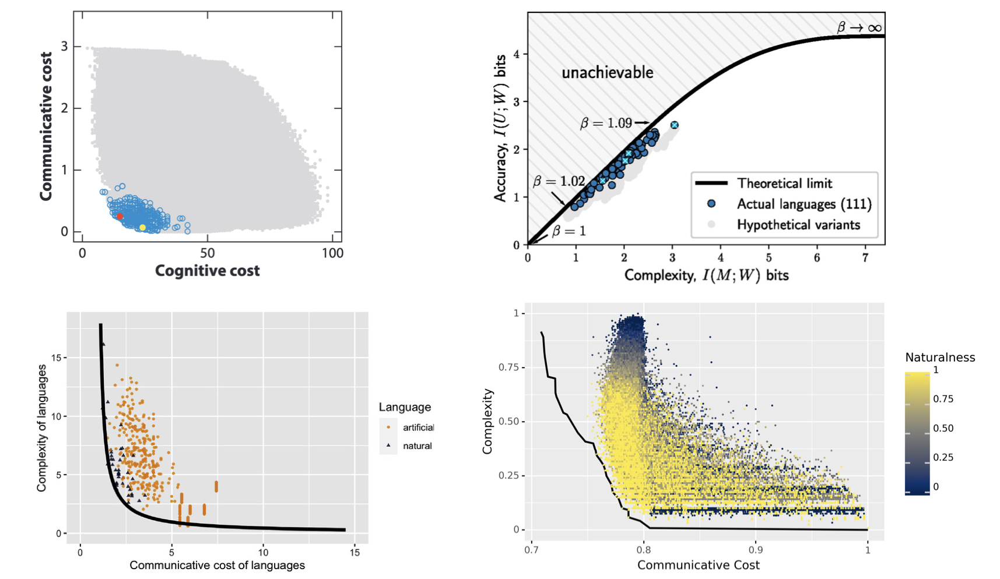

# The Artificial Language ToolKit (ALTK)

*Four examples of many recent results showing that natural languages are optimized for efficient communication.*

## Introduction

ALTK is a software library that aims to support research in [Unnatural Language Semantics](https://gu-clasp.github.io/static/951dfcd6d280ce7416e79e206c291358/clasp.pdf) -- a program in linguistics and cognitive science that tries to describe and explain the properties of natural languages by comparing them to the much larger set of mathematically possible languages.

A current focus is on **_efficient communication_**: determining whether linguistic meanings are optimized for a trade-off between cognitive complexity and communicative precision.

Key features:

- Primitives for constructing semantic spaces, expressions, and languages
- Simplified logic for measuring informativity of languages / communicative success of signaling agents
- Methods for language population sampling and optimization w.r.t Pareto fronts

## Future work

ALTK is a long term project and it is currently in its early stages. 

However, it is intended to help lower the barrier to entry for certain research in computational semantics, and to and unify methodologies. So if you find something confusing or would like to collaborate, please contact the developers or open an issue. And if you have a phenomena of interest in linguistic semantics that you want to run an efficient communication analysis on, we are _very_ interested in helping!

 Goals for future work

 

Immediate goals include reproducing the efficient communication analyses for the domains of:

- color terms
- quantifiers
- numerals

Longer term goals for ALTK include providing support for:

- other causal analyses of linguistic domains, e.g. explanations from ease of learnability
- building blocks to support closer integration of linguistics, emergent communication and NLP
- generating artificial data for NLP experiments
- constructing languages for psycholinguistics research

## Installing ALTK

1. Install via pip:

    `python3 -m pip install git+https://github.com/nathimel/altk.git`

2. Get the required packages by running

    `conda env create --file environment.yml`

## Getting started

- For an introduction to efficient communication research, here is a [survey paper](https://www.annualreviews.org/doi/abs/10.1146/annurev-linguistics-011817-045406) of the field.
- For an introduction to the RSA framework, see [this online textbook](http://www.problang.org/).
- Check out the basic [signaling game](src/examples/signaling_game) example.
- For a more scaled up usage example, visit the codebase for an efficient communication analysis of [modals](https://github.com/nathimel/modals-effcomm).

## References

Figures:

> Kemp, Charles & Terry Regier. 2012. Kinship categories across languages reflect
general communicative principles. Science (New York, N.Y.) 336(6084). 1049–1054. doi:10.1126/science.1218811.

> Denic, Milica, Shane Steinert-Threlkeld & Jakub Szymanik. 2022. Indefinite Pronouns Optimize the Simplicity/Informativeness Trade-Off. Cognitive Science 46(5). e13142. doi:10.1111/cogs.13142

> Zaslavsky, Noga, Charles Kemp, Terry Regier & Naftali Tishby. 2018. Efficient
compression in color naming and its evolution. Proceedings of the National
Academy of Sciences 115(31). 7937–7942. doi:10.1073/pnas.1800521115. 

> Steinert-Threlkeld, Shane. 2021. Quantifiers in Natural Language: Efficient Communication and Degrees of Semantic Universals. Entropy. An International and Interdisciplinary Journal of Entropy and Information Studies 23(10). 1335. doi:10.3390/e23101335.

Links:

> Kemp, Charles, Yang Xu & Terry Regier. 2018. Semantic typology and efficient
communication. Annual Review of Linguistics 1–23. doi:10.1146/annurev-linguistics-011817-045406

> N. Imel and S. Steinert-Threlkeld, Modals in natural language optimize the simplicity/informativeness
trade-off, in Proceedings of Semantics and Linguistic Theory (SALT 32), 2022.
